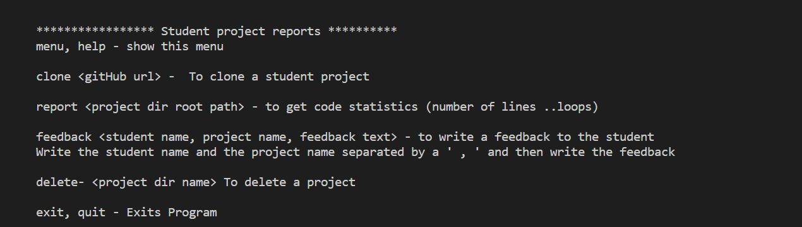

# Code-feedback
This application in its first release is a simple application that is directed to teachers of computer science and gives the ability to;  

Usage:  
+ Get report on the project code for java and javascript which contains:  
  + Number of project lines
  + Number of control statements
  + number of characters
+ Write feedback
+ save the feedback to a file.
+ Delete a downloaded project.

# How to use the app 
Writ in the console command  
  + npm start  

  

Choose an option  
 for example 
 clone https://github.com/theStudent-project-url  
 the project will be downloaded in the students-projects folder  

 # Contributing

1. [Fork it](https://github.com/Shirin20/code-feedback)
2. Install dependencies (`npm install`)
3. Create your feature branch (`git checkout -b my-new-feature`)
4. Commit your changes (`git commit -am 'Added some feature'`)
5. the app is tested with [manuel tests](./test/manuel-tester.md)
6. Push to the branch (`git push origin my-new-feature`)

# requirements to develop
 + Send feedback to a student;   
The code feedback that the teacher will write to a student will be saved in students-reports-feedback.txt, the idea behind EmailSender.js is to give the ability to send the feedback to the student via mail, the code was ready but when trying to implement and run the code, the whole process failed because it had a problem with credentials   
Even though the right password and the right user nam are being used 
But it seems that its a problem in the google service itself which we must figure out a way to solve it in the next release.  

+ The app needs to handle error to make sure that the application will not crash under run time.
the plan is to add try catch statements and handle errors in the view catalog

