# laboration 2, 1dv610

​

## Checklista

- [x] Jag har skrivit all kod och reflektioner själv. Jag har inte använt mig av andras kod för att lösa uppgiften.
- [x] Mina testresultat är skrivna utifrån utförd testning ( och inte teoretiskt: "det bör fungera" :) )
- [x] Koden är objektorienterad
- [x] Jag har skrivit en modul som riktar sig till programmerare
​

## Egenskattning och mål

- [ ] Jag är inte klar eftersom jag vet att jag saknar något. (Då skall du inte lämna in! Lämna då istället in på restlaboration.)
- [x] Jag eftersträvar med denna inlämning godkänt betyg (E-D)
  - [x] De flesta testfall fungerar
  - [x] Koden är förberedd på Återanvändning
  - [ ] All kod samt historik finns i git
  - [x] Kodkvaliterskraven är ifyllda
  - [x] Reflektion är skriven utifrån bokens kapitel
- [ ] Jag eftersträvar med denna inlämning högre betyg (C-B) och anser mig uppfylla alla extra krav för detta.
  - [x] Samtliga testfall är skrivna
  - [] Testfall är automatiserade
  - [x] Det finns en tydlig beskrivning i hur modulen skall användas (i git)
  - [x] Kodkvalitetskraven är varierade
- [ ] Jag eftersträvar med denna inlämning högsta betyg (A)
​
Förtydligande: Examinator kommer sätta betyg oberoende på vad ni anser.
​

## Återanvändning
[redme.md](https://github.com/Shirin20/code-statistics)
​

## Beskrivning av min kod

koden är dellat enligt mvc modellen
Jag har 6 moduler
- Reporter.js den produserar raporter på project kod
- GithubProject.js  
Den ger möjlighet att clona ner , ta bort projects  
- FileWriter.js write feedback on a file
- User console.js  
Den prints the menue , statistics, and gets feedback from the user  
ErrorHandler.js  

- app.js  
Den jobber som coordinator och mellan the model and the view

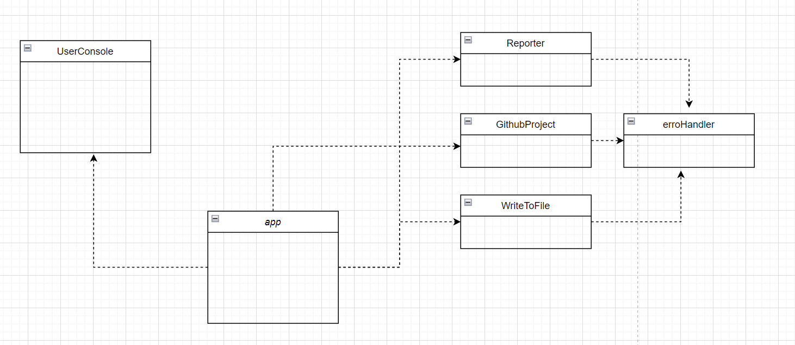
​

## Hur jag testat

Jag har utfört manuella tester 
​

### Testfall

​[test fall](test/manuel-tester.md)  

## Test report  

​[test fall](test/test-report.md)

## Kodkvalitetskrav

​
**Fetmarkera** de "regler" som används ur CC. Ni kan frångå tabellformat om ni vill. Skapa direktlänkar till er kod där det är lämpligt. Skriv så att jag kan förstå.
​​

## Laborationsreflektion

Efter att jag läste en bra del av clean code boken så märkte jag att jag förstår bättre vad menas med good programming och att  koden räknas inte bra när den bara fungerar och gör vad den måste göra men det handlar om mycket andra saker bland annat att den måste se ut på ett sätt som gör att den är lätt att läsa och skriven på ett sätt så att andra kan förstå den och även att det blir lättare att utveckla , återanvända den, samt att den blir skalbart
I lab2 så försökte jag följa dem principer som clean forfatteren tar up i sin bok och så jobbade Jag på att refaktorera min kod i lab1 och skriva min kod till lab2 appen.
Här kommer några exempel   
 
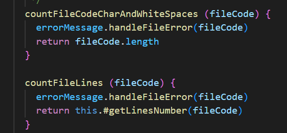  
 
I refactoring min kod så har jag ändrat många veriable and methods namn som countFileCodeCharAndWhiteSpaces() hette countFileCodeChar() i början men andrat till and whitespaces så att den viser att den räknar alla charechters tillsammans med blanksteg
Och den är en verb fras för metoders namn ska vara verb fras enligt boken

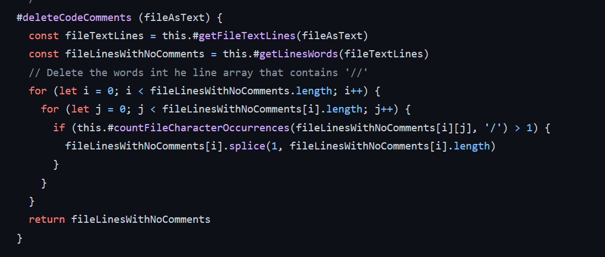
 
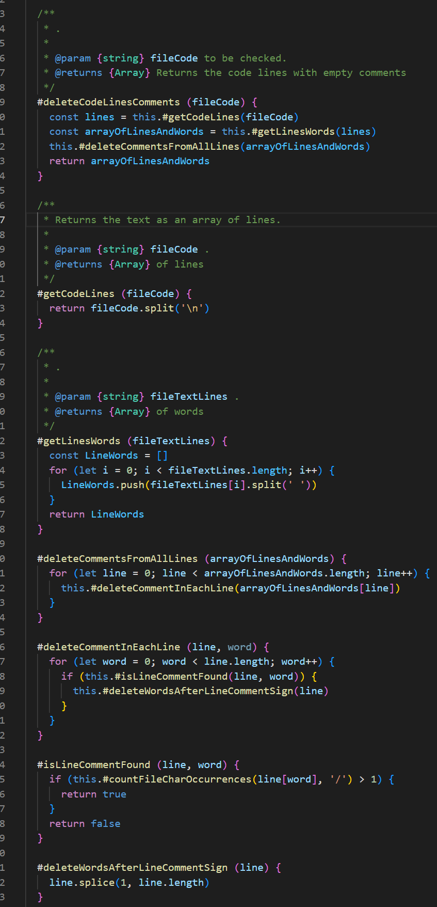  
 
Stort del av refactorings fokus var på att försöka refaktorera metoderna så att varje metod gör en grej bara  
Exemplen visar hur metoden såg ut först:  komplicerat svårt att analysera och förstå  
Och hur den blev delat till små andra metoder som är lättare att begripa, åter använda  
Huvud metoden har nu en level av abstraktion
 

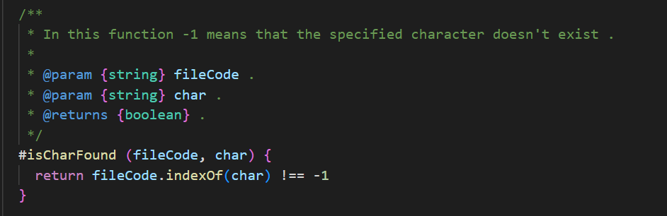  
 
Enligt boken Kommentarer kompenserar inte för dålig kod, så refaktorering resulterade i att många kommentarer raderades eftersom koden kunde uttrycka sig på ett sätt som den inte behöver en kommentar, men samtidigt så fanns det en del metoder som jag behovde kommentera som det var nämnd i boken att Det är ibland användbart att ge grundläggande information med en kommentar.  
 

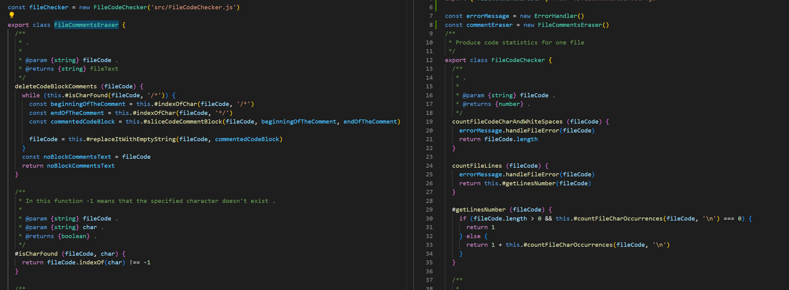
 

I båda lab 1 och lab två har jag delat koden i flera klasser och i varje klass har jag skapat metoder som hör till samma koncept vilkengör att klassen gör bara en grej och att dem är små, men samtidigt när jag brytat stora metoder in till små metoder så behövde jag dela på en klass till två klasser, klassen heter FileCodeChecker.js och så skapade jag en ny klass  FileCommentsEraser.js och flyttade alla metoder som gör samma sak till den
 

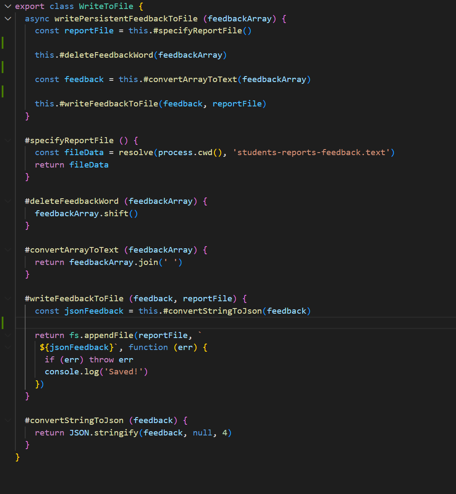   
När jag skrivit koden och restraktuert den så hade jag koll på vertikal formatting, att båda ha openness när jag har kodrader som har olika koncepten och vertikal density när det finns association
även har placerat metoder som anropar varandra nära varandra och i bra ordning
 

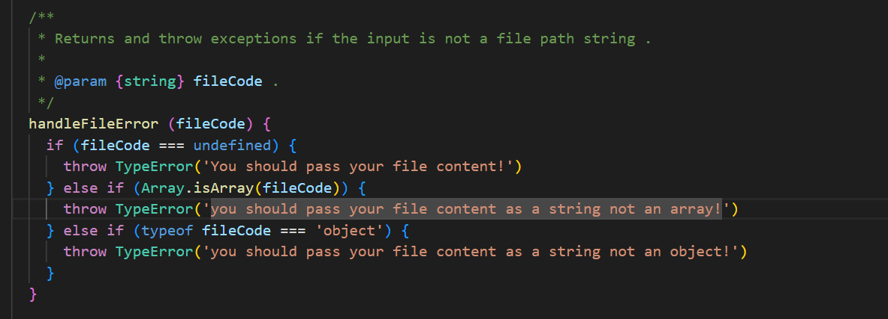   
Error handling kapital rekomenderar att man använder undantag istället för return satster och att varje undantag som man kastar bör ge tillräckligt med sammanhang för att bestämma källan och platsen för ett fel. och det visas tydlig i min kod exemple. samtidigt behöver jag utveckla vidare på min fel hantering och använda try catch satser var det passar så att programmet ska va i en konsekvent tillstånd, oavsett vad som händer i (try).till exemple att använda try-catch-sats var det finns kod som ger
undantag som hjälper att definiera vad användaren av den koden ska förvänta sig, oavsett vad
går fel med koden som körs i försöket

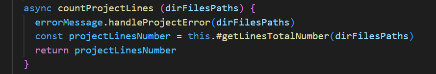   
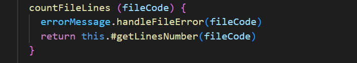   
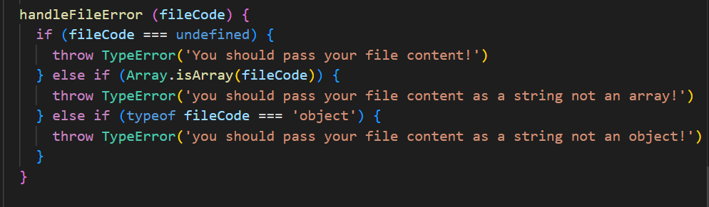   

Demeterlagen säger att en modul inte bör
känna till insidan av de föremål som den manipulerar. objekt
dölja sina data och avslöja operationer. Det betyder att ett föremål inte ska exponera sitt  intern struktur genom accessorer eftersom att göra det är att avslöja, snarare än att dölja, dess inre struktur. Metoden ska inte anropa metoder på objekt som returneras av någon av tillåtna funktioner. Med andra ord, prata med vänner, inte med främlingar  

I Kapital 8 beskriver författaren hur det kan bli problemtisk när man använder sig av en tredje part kod genom hela systemet vilken betyder en stor fixing arbete om denna tredje kod ändras eller att själva systemet ändras. Och när jag tänkar på min program och modulen som används av programmet, så märkar jag att jag måste fundera över, och jobba på att isolera program koden fron modulens kod och incapsla modulens kod samt höja abstrktions
genom att skapa en klass kanske och stoppa modulen i den. Jag gör en funktion för varje funktion.

  
I min lab2 program använde jag MVC modellen för separation of concerns
kontrollen tar ansvar för att bygga de nödvändiga objekten för systemet och skickar dem sedan till applikationen, som helt enkelt använder dem. Och modellen har ingen dependency på kontrollen, den är  frikopplad från detaljer som det är nämnd i boken ,jag har delat och placerat allt som har att göra med app logiken i modellen vilken underlättar böda skalnings arbete och utvecklingsarbete   men på andra sidan så måste jag tänka genom app.js och UserConsole.js för de har gömda beroende till exempel del koden som ger användaren möjligheten att mata in sin val av menyn ligger i kontrollen och den bör flyttas till user console.

Innan jag läste boken hade jag alltid denna tanken att jag behöver öva och paktisera mycket för att kunna skriva renare kode, skriva kod som blir skalbart , lät och förtå , men jag hade inga tydliga regler och grunder för att hjälpa mig att nå målet. boken hjälpte mig identifer broblem som fanns i koden och gav mig lösningar och bästa praxis, höja abstraktions nivå, välja ut bra namn, bygga bra enkapslade klasser, skriva små funktioner ...och så vidare, den ändrade min tanke om kod, hur att skriva kod.
