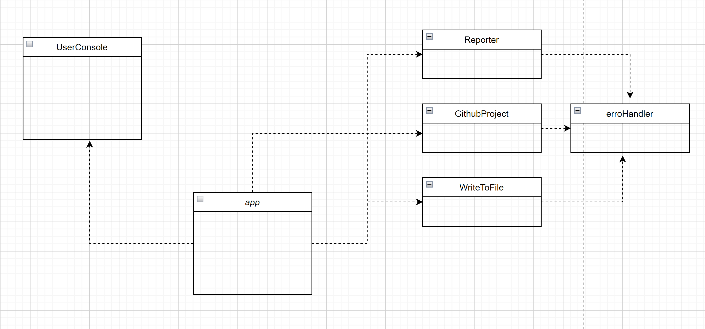

# Mall för inlämning laboration 1, 1dv610
​
## Checklista
  - [x] Jag har skrivit all kod och reflektioner själv. Jag har inte använt mig av andras kod för att lösa uppgiften.
  - [x] Mina testresultat är skrivna utifrån utförd testning ( och inte teoretiskt: "det bör fungera" :) )
  - [x] Koden är objektorienterad
  - [x] Jag har skrivit en modul som riktar sig till programmerare
​
## Egenskattning och mål
  - [ ] Jag är inte klar eftersom jag vet att jag saknar något. (Då skall du inte lämna in! Lämna då istället in på restlaboration.)
  - [x] Jag eftersträvar med denna inlämning godkänt betyg (E-D)
    - [x] De flesta testfall fungerar
    - [x] Koden är förberedd på Återanvändning
    - [ ] All kod samt historik finns i git 
    - [x] Kodkvaliterskraven är ifyllda
    - [x] Reflektion är skriven utifrån bokens kapitel 
  - [ ] Jag eftersträvar med denna inlämning högre betyg (C-B) och anser mig uppfylla alla extra krav för detta. 
    - [ ] Samtliga testfall är skrivna    
    - [] Testfall är automatiserade
    - [x] Det finns en tydlig beskrivning i hur modulen skall användas (i git)
    - [x] Kodkvalitetskraven är varierade 
  - [ ] Jag eftersträvar med denna inlämning högsta betyg (A) 
​
Förtydligande: Examinator kommer sätta betyg oberoende på vad ni anser. 
​
## Återanvändning
(redme.md)[https://github.com/Shirin20/code-statistics]
​
## Beskrivning av min kod
koden är dellat enligt mvc modellen 
Jag har 3 moduler 
* ProgramActions.js 
Den ger möjlighet att clona ner , ta bort projects, get code statistics , write feedback on a file
* User console.js  
Den prints the menue , statistics, and gets feedback from the user
* app.js  
Den jobber som coordinator och mellan the model and the view 

​
## Hur jag testat
programmet var testat genom hela utvecklings tiden med automatiska tester for två klasses (ProjectCodeChecker.js och FileCodeChecker.js som använder andra klassers metoder (ErrorHandlar.js , ProjectFilesReader.js) genom att använda jest ramverk.)
​
### Testfall

​

​
## Kodkvalitetskrav
​
**Fetmarkera** de "regler" som används ur CC. Ni kan frångå tabellformat om ni vill. Skapa direktlänkar till er kod där det är lämpligt. Skriv så att jag kan förstå.
​​
## Laborationsreflektion
Efter att jag läste en bra del av clean code boken så märkte jag att jag förstår bättre vad menas med good programming och att  koden räknas inte bra när den bara fungerar och gör vad den måste göra men det handlar om mycket andra saker bland annat att den måste se ut på ett sätt som gör att den är lätt att läsa och skriven på ett sätt så att andra kan förstå den och även att det blir lättare att utveckla , återanvända den, samt att den blir skalbart 
I lab2 så försökte jag följa dem principer som clean forfatteren tar up i sin bok och så jobbade Jag på att refaktorera min kod i lab1 och skriva min kod till lab2 appen.
Här kommer några exempel
