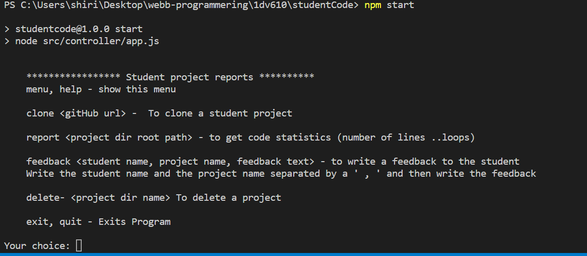
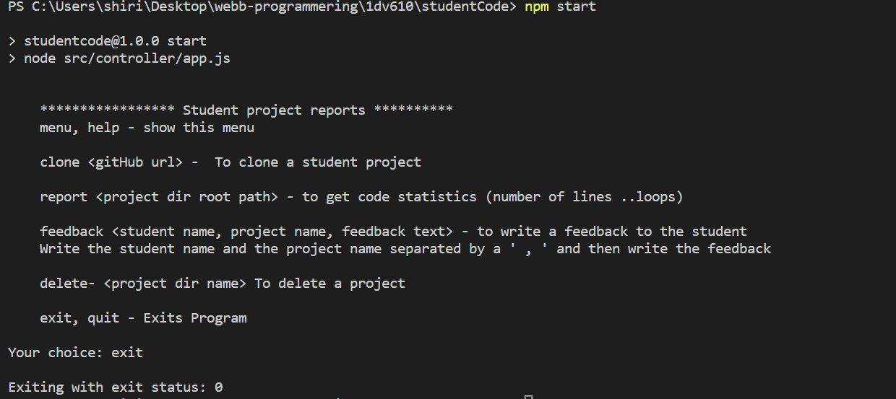
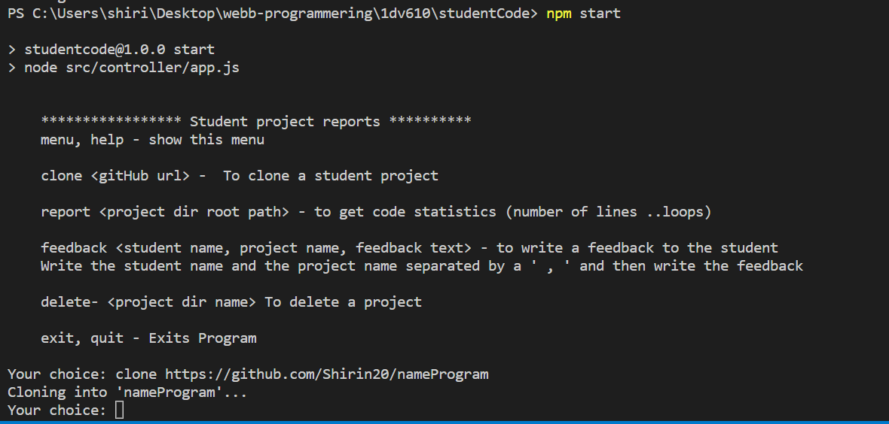
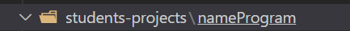
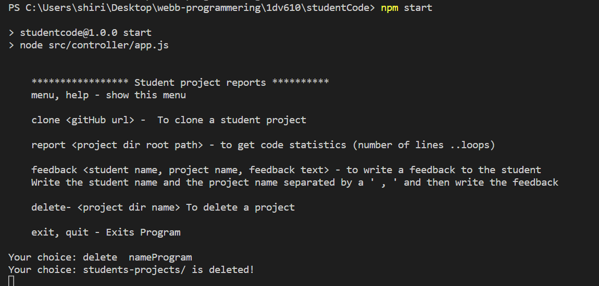
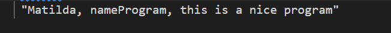
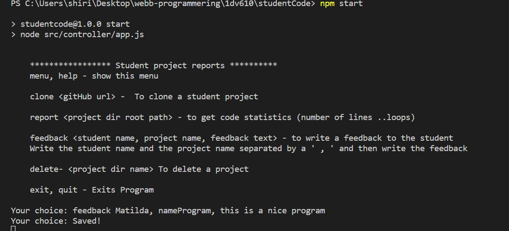

Test Cases  
    

1.1 show menu
Open the terminal
Run the command 
    npm start
A menu appears
output:  

2.1 exit the program
Requirement: 1.1
Type in exit
The program exits with code 0
output:  
   

3.1 clone github project
Requirement: 1.1
Type in clone <github url>
The project should appear in students-projects folder 
output:  
   
   

4.1 Delete project
Requirement: 1.1,- 2,2
Type in delete nameProgram
output:  
  

5.1 Write feedback and check its save in the file
Requirement: 1.1,- 2,2
Type in 
      feedback Matilda, nameProgram, this is a nice program
output:  
  
  

# Test report
[test report](./test-report.md)
